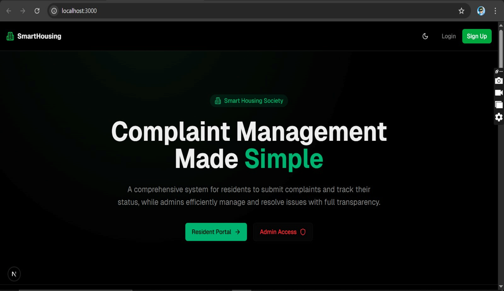
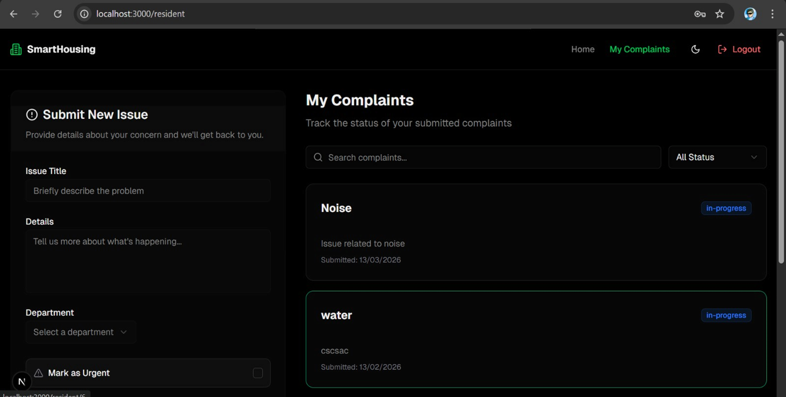
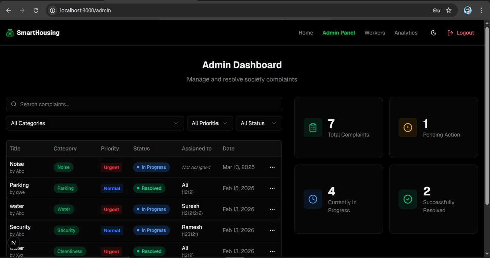
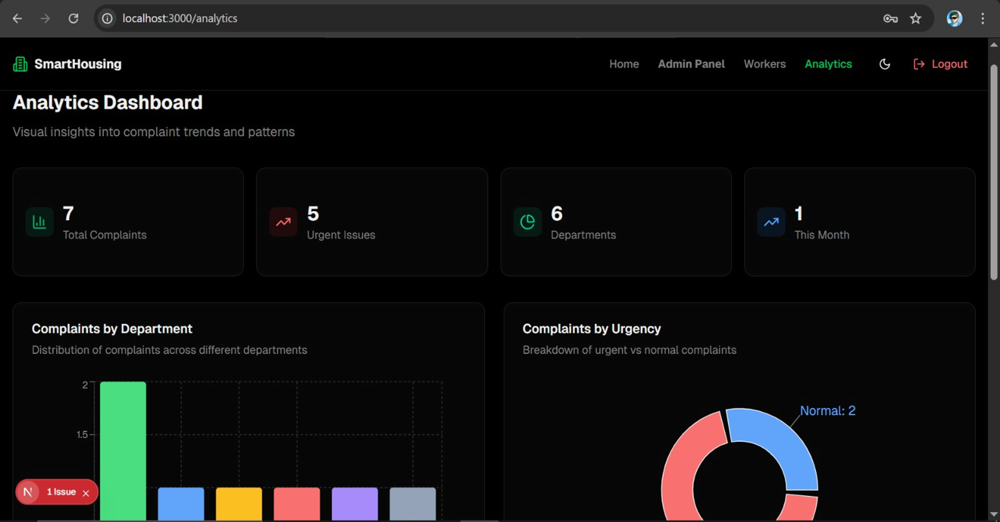

# Smart Digital Complaint Management System for Housing Societies

Rapid urbanization has led to an increase in housing societies, making complaint management more complex. Traditional methods like registers and messaging apps are inefficient and lack proper tracking.

## 🚀 Features
* **User Dashboard:** Residents can file new complaints and view history.
* **Admin Panel:** Separate login for administrators to assign tasks and update status.
* **Status Tracking:** Real-time updates (e.g., Pending, In-Progress, Resolved).

## 🛠️ Tech Stack
* **Frontend:** [ Next.js / Typescript / Tailwaid css]
* **Backend:** [ Django ]
* **Database:** [ SQLite ]
* **Authentication:** JWT (JSON Web Tokens)

## 🏁 Getting Started
1. Clone the repository:
   `git clone https://github.com/Ayushhhh111/Complaint_Management.git`
2. Install dependencies:
   Frontend:
      `pnpm add axios lucide-react clsx tailwind-merge react-hook-form zod framer-motion`
    Backend:
       `pip install djangorestframework django-cors-headers djangorestframework-simplejwt mysqlclient pillow`
3. Run the project:
   ### Frontend (Next.js)
1. Navigate to the frontend folder:
   `cd frontend`
2. Install dependencies:
   `pnpm install`
3. Run the development server:
   `pnpm dev`

### Backend (Django)
1. Navigate to the backend folder:
   `cd backend`
2. Create a virtual environment:
   `python -m venv venv`
3. Install dependencies
4. Run migrations and start server:
   `python manage.py migrate`
   `python manage.py runserver`

## 📸 Screenshots

### Home page

### Resident Home Page

### Admin Dashboard

### Analytics Page
